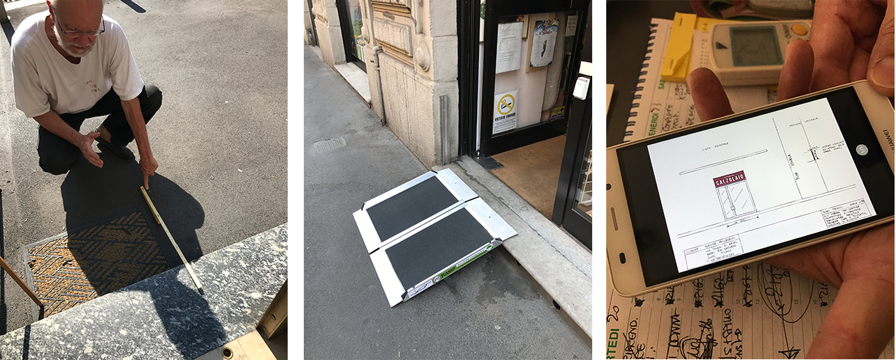

Purtroppo i negozianti Milanesi non possono solamente acquistare una rampa e un campanello per essere in regola, ma deve seguire una procedura burocratica per fare in modo che il Comune di Milano possa verificare:
- Che le dimensioni e gli attributi della rampa siano corretti
- Se è possibile posizionare la rampa davanti al negozio senza compromettere l'uso del marciapiede
- E regolamenti più specifici ...

## La ricerca
La procedura non è esattamente semplice da seguire, quindi abbiamo organizzato un incontro pubblico dove abbiamo chiesto agli esercenti del quartiere Isola di Milano di provare a completare la procedura sotto i nostri occhi, come si può vedere dal post di follow-up a questo [link](https://edgeryders.eu/en/open-rampette-la-procedura-incontro-2305-lastecca30).

Abbiamo ricevuto ottimi riscontri e informazioni che ci hanno portato alla preparazione di interviste per gli esercenti da svolgere direttamente nei loro negozi.

**_“Non è chiaro quando sia necessario contattare un tecnico professionista…”_**

**_“Informazioni difficili sono la misura della pedana, altezza e lunghezza e pendenze. Come le calcolo?”_**

Abbiamo inizialmente analizzato le varie situazioni specifiche di ogni esercizio commerciale e abbiamo chiesto informazioni come ad esempio:
- Come ha ricevuto l’informazione che si dovevi seguire una procedura di regolamentazione?
- Avete mai visto la procedura?
- Ha provato a seguire la procedura autonomamente o ha chiesto ad un professionista di fare il lavoro per Lei?
- Ha capito esattamente che cosa chiede la procedura ed è stato facile trovare questi dati?

Pianificare ed eseguire interviste è stato un lavoro piuttosto oneroso, ma è stato anche estremamente utile da una un punto di vista della progettazione. Ci ha aiutato a comprendere molte sfumature sui problemi degli esercenti alla comprensione e compilazione della procedura ed i loro bisogni, desideri e sensibilita’ nel risolvere il problema dell'accessibilità dei loro negozi.

**_“Vogliamo far entrare chiunque nel nostro negozio, ci piacerebbe risolvere questo problema per le persone”_**

**_“Prima cerchiamo di risolvere autonomamente se non ci riusciamo ci facciamo supportare da qualcuno.”_**

**_“Se questo stesso modulo fosse possibile averlo online non solo da computer, magari sul sito del comune di milano, che ti possa dare questi risultati mettendo le misure, sarebbe il massimo.”_**

Qui sotto si puo’ vedere un grafico che mostra gli argomenti che abbiamo coperto durante le interviste, in cui ognuna delle forme rappresenta il profilo di un esercente che abbiamo intervistato. Sovrapponendo le forme si possono vedere gli argomenti (dubbi, esigenze) che sono risultati più rilevanti (un livello piu’ alto di rilevanza verso l'esterno del grafico, un livello piu’ basso verso il centro).

<iframe src="https://drive.google.com/file/d/0B2Qw-X5Jj_X_LU44S0hHdDdBSTg/preview" width="640" height="480"></iframe>

Qui di seguito si puo’ invece vedere un altro grafico che ricostruisce il profilo di Minerva che inizialmente avevamo inventato. Aggiungendo le vere esigenze degli esercenti che abbiamo intervistato, finalmente abbiamo un profilo di Minerva realistico che possiamo utilizzare per progettare una procedura migliore!

<iframe src="https://drive.google.com/file/d/0B2Qw-X5Jj_X_ZjFmZnBWVjhXRmc/preview" width="640" height="480"></iframe>

## Il prototipo

Al fine di garantire l'accessibilità, la compatibilità per sistemi operativi e piattaforme differenti e per consentire di modificare agilmente e in vista di una futura implementazione, abbiamo deciso di prototipare questo strumento come una web app, accessibile da qualsiasi browser.

Ecco i fattori chiave che ci hanno portato a progettare uno strumento che si concentra sulle necessità dell’utente e non sulle necessità della burocrazia:

**Complessità**

È molto comune purtroppo che le procedure burocratiche siano progettate in modo da soddisfare principalmente le esigenze della burocrazia. Nel nostro caso ad esempio il modo in cui sono organizzate le informazioni nella procedura non prende in considerazione come Minerva (la proprietaria del nostro negozio) avrebbe ragionato davanti al problema dell'accessibilità, ma altresì sono poste nella prospettiva di risolvere un problema burocratico, principalmente dal punto di vista della persona che avrebbe esaminato il modulo riempito.
Quindi la prima cosa che abbiamo fatto è stata la creazione di uno schema logico delle domande che Minerva si sarebbe chiesta approcciando il problema dell'accessibilità.
[
[Pic data flow]](https://edgeryders.eu/uploads/default/original/2X/9/9a613777d0431bccbdada123312b4a7ad8233e1c.jpg)

Le domande che avrebbero esonerato in modo più diretto Minerva dal completamento della procedura sono state messe in primo piano. Questo potrebbe sembrare strano o ingiusto per alcuni di voi, come se volessimo favorire gli esercenti a saltare la procedura, ma naturalmente questo non è quello che vogliamo... Proviamo a metterci per un secondo nei panni di Minerva, saresti felice o frustrata di aver calcolato marciapiede, scalino, pendenza, aver cercato online una rampa (o contattato un produttore di rampe) solo per poi sapere che dato che il tuo negozio è in fase di ristrutturazione è obbligatorio seguire un altro tipo di procedura? Penso che chiunque tra noi Minerve si sentirebbe alquanto frustrata...

È con questo approccio che abbiamo fatto del nostro meglio per guidare Minerva esattamente alle aree della procedura che più sono di interesse per la sua situazione specifica, evitandole in questo modo di dover leggere (a meno che non lo voglia esplicitamente) ciò che di fatto non sarebbe di suo interesse per la risoluzione del suo problema.

**Comprensione**

Un grosso problema della procedura riscontrato durante la ricerca con gli utenti sono stati i termini tecnici.
Dopo aver letto e riveduto tutti i documenti, abbiamo approcciato al problema in due modi:
Innanzitutto abbiamo cercato di capire e interpretare al meglio ciò che veramente la domanda chiedeva, per poi quindi riformulare una nuova domanda che arrivasse al punto ed utilizzando un linguaggio più possibile vicino a quello di Minerva
In secondo luogo abbiamo seguito la regola che "un'immagine vale mille parole" e abbiamo accompagnato il testo con immagini e illustrazioni ovunque possibile

**Assistenza**

In linea con la semplificazione della logica della procedura e la ristrutturazione del flusso di dati, abbiamo deciso di dare a questo strumento digitale la forma di una serie di domande, proprio come se Minerva fosse intervistata e assistita da un dipendente del comune durante il riempimento la procedura.

**Piacere**

Ultimo ma non meno importante, abbiamo voluto dare all'interfaccia un aspetto fresco ma soprattutto semplice. Abbiamo deciso di utilizzare le linee guida grafiche del progetto opencare, ma sforzandoci soprattutto di:
Rendere il testo molto leggibile
Facilitare l’individuazione e comprensione dei pulsanti per la navigazione
Evitare icone e illustrazioni non chiare

È possibile testare il prototipo qui ([link](https://pr.to/7VVRQ5/)).
Il tuo feedback sarebbe estremamente prezioso per darci la possibilità di progettare uno strumento migliore!
